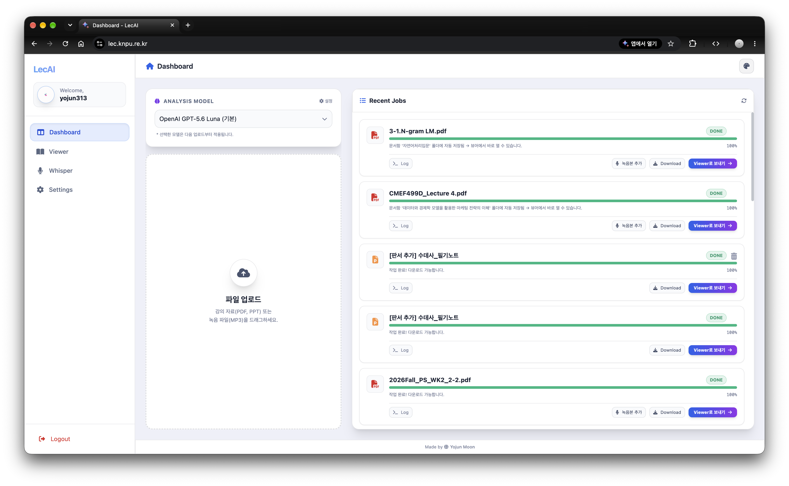
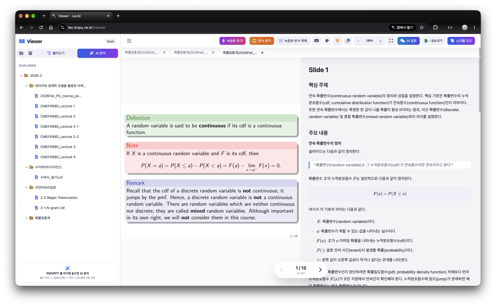
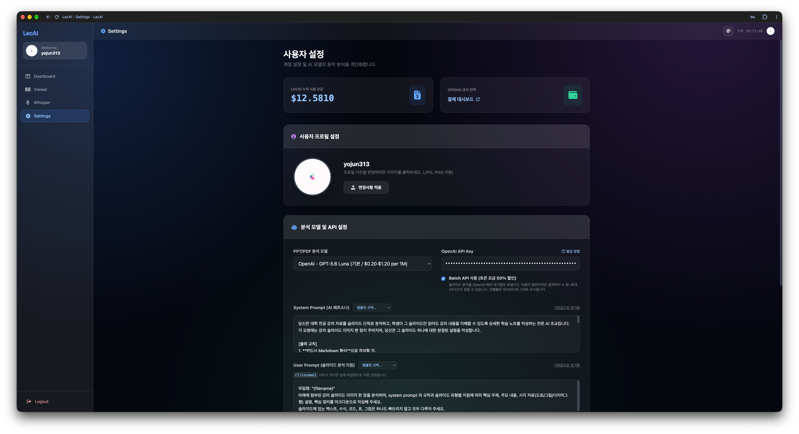

## 1. System Requirements

The project relies on several system-level tools for file conversion, PDF processing, and audio transcription.





* **LibreOffice**: To convert PPT/PPTX slides to PDF.
* **Poppler-utils**: For `pdf2image` to extract frames from PDF files.
* **wkhtmltopdf**: Used by `pdfkit` to generate PDF reports from Markdown.
* **FFmpeg**: Required for audio processing and STT (Faster-Whisper).

---

## 2. Option A: Local Installation

### 1) Install System Packages

**Ubuntu / Debian:**

```bash
sudo apt update
sudo apt install -y libreoffice poppler-utils wkhtmltopdf ffmpeg fonts-nanum
curl -LsSf https://astral.sh/uv/install.sh | sh
```

### 2) Setup Python Environment

```bash
git clone https://github.com/yojun313/LecAI.git
cd LecAI

uv sync
source .venv/bin/activate
```

### 3) Configuration

Create a `.env` file in the root directory. There exists `.env.example` in root directory.

Set `GENERATE_PDF=true` to also produce `result.pdf` for each analysis (off by default).

Speech-to-text for lecture recordings uses the OpenAI Audio API with each user's own OpenAI API key (registered in Settings).
`OPENAI_STT_MODEL` selects the model (default `gpt-transcribe`); long recordings are split automatically.

### 4) Run the Server

```bash
python3 run.py
```